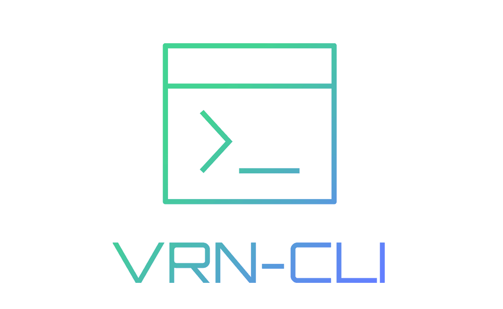

<div align="center">

<a href="https://github.com/haiquy572001/suco-cli">

</a>


[](https://codecov.io/gh/haiquy572001/suco-cli)
[](https://www.npmjs.com/package/@haiquy572001/suco-cli)

[](http://commitizen.github.io/cz-cli/)
[](https://pnpm.io/)

</div>

`@haiquy572001/suco-cli` is an automated command line tool whose core feature is to help you quickly build an engineered project via `boilerplate`. It supports multiple creation modes, you can get `boilerplate` from the sources we provide, or you can specify a third party or your own source.

> ⚠️ Please make sure your **Node.js version >=18.0.0**

## Quick Start

First you need to install `@haiquy572001/suco-cli` globally

```sh
npm install -g @haiquy572001/suco-cli
# or with yarn
yarn add --global @haiquy572001/suco-cli
# or with pnpm
pnpm install -g @haiquy572001/suco-cli
```

Next, use the `create` command, followed by the name of the directory you prefer

```sh
vrn create my-app
```

Create a project with the pre-defined `boilerplate-package` in a few simple command line interactions!

> Since the dependencies of services other than the ontology are dynamically managed, checks and incremental installations are performed during use

Of course, it is possible to use `npx` to execute commands directly without installation

```sh
npx @haiquy572001/suco-cli create my-app
```

## Advanced Guide

See [haiquy572001/suco-cli repository](https://github.com/haiquy572001/suco-cli)
